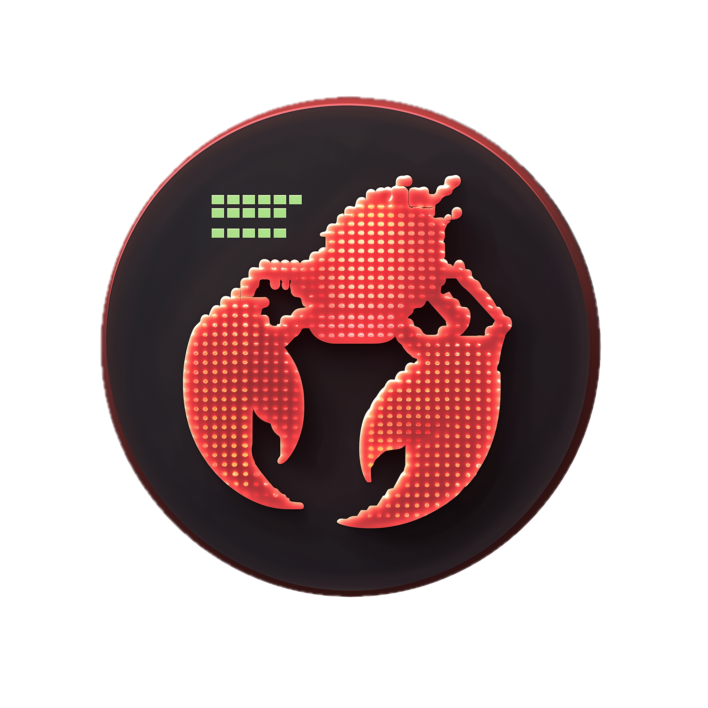

<p align="center">
  
</p>

<h1 align="center">Clawome</h1>

<p align="center">
  <strong>DOM Compressor + Task Agent for AI Agents</strong><br/>
  Turn 300K-token web pages into 3K-token structured trees, and let AI agents autonomously browse the web.
</p>

<p align="center">
  <a href="#quick-start">Quick Start</a> &bull;
  <a href="#features">Features</a> &bull;
  <a href="#api-reference">API Reference</a> &bull;
  <a href="#benchmarks">Benchmarks</a> &bull;
  <a href="#roadmap">Roadmap</a>
</p>

---

## The Problem

Raw HTML is **massive** and full of noise. A typical search results page has ~300K tokens of HTML, but an AI agent only needs ~3K tokens to understand and interact with it. Sending raw HTML to an LLM wastes tokens, costs money, and often exceeds context limits.

## The Solution

Clawome sits between your browser and your AI agent. It provides two core capabilities:

1. **DOM Compression** — Compresses live web pages into clean, structured trees that preserve visible text, interactive elements, and semantic structure while stripping noise (CSS, scripts, ads, hidden elements). 300K tokens → 3K tokens.

2. **Task Agent** — An autonomous browser agent that takes a natural language goal, plans subtasks, executes browser actions, and returns structured results with Markdown formatting.

## Features

### DOM Compression
- **100:1 compression ratio** on typical web pages
- Preserves all visible text, interactive elements (buttons, links, inputs), and semantic structure
- Hierarchical node IDs (e.g., `1.2.3`) for precise element targeting
- Site-specific optimizers for Google, Wikipedia, Stack Overflow, YouTube, etc.
- Lite mode for even more aggressive token savings

### Task Agent
- **Natural language tasks** — Describe what you want in plain language
- **Multi-step planning** — Automatically breaks complex tasks into subtasks
- **Smart execution** — Perceive → Plan → Act → Sense loop with retry handling
- **Flow anomaly detection** — Detects loops, stuck states, and error patterns without extra LLM calls
- **Markdown results** — Final results are formatted in Markdown with structured data
- **12+ LLM providers** — OpenAI, Anthropic, Google, DeepSeek, DashScope (Qwen), Moonshot, Zhipu, Mistral, Groq, xAI, and more via LiteLLM
- **Safety constraints** — Browser-only actions, no form submissions unless explicitly asked, hard step limits

### Dashboard
- **Browser Playground** — Interactive DOM viewer and browser control
- **Agent UI** — Task input, real-time progress tracking, collapsible step details
- **Settings** — LLM provider config, browser options, compression settings
- **API Docs** — Built-in documentation with Chinese/English support

## Quick Start

### Prerequisites

- Python 3.10+
- Node.js 18+

### 1. Download

```bash
git clone https://github.com/CodingLucasLi/Clawome.git
cd Clawome
```

### 2. Environment Configuration

Copy the example environment file and fill in your LLM credentials (required for Task Agent):

```bash
cp .env.example .env
```

Edit `.env`:

```bash
# LLM Provider — supports 12+ providers via LiteLLM
LLM_PROVIDER=dashscope          # openai / anthropic / google / deepseek / dashscope / ...
LLM_API_KEY=sk-your-api-key
LLM_MODEL=qwen-plus             # Model name for your provider
```

> The `.env` file is optional if you only use the DOM compression API.

### 3. One-Command Start

```bash
./start.sh
# Dashboard:  http://localhost:5173
# API:        http://localhost:5001
```

`start.sh` will automatically set up the Python virtual environment, install dependencies, download Chromium, and start both servers.

<details>
<summary>Manual Setup</summary>

```bash
# Backend
cd backend
python -m venv venv
source venv/bin/activate    # Windows: venv\Scripts\activate
pip install -r requirements.txt
playwright install chromium
python app.py               # Starts on http://localhost:5001

# Frontend (in another terminal)
cd frontend
npm install
npm run dev                 # Starts on http://localhost:5173
```

</details>

## API Reference

### Navigation

| Method | Endpoint | Description |
|--------|----------|-------------|
| POST | `/api/browser/open` | Open URL (launches browser if needed) |
| POST | `/api/browser/back` | Navigate back |
| POST | `/api/browser/forward` | Navigate forward |
| POST | `/api/browser/refresh` | Reload page |

### DOM

| Method | Endpoint | Description |
|--------|----------|-------------|
| GET/POST | `/api/browser/dom` | Get compressed DOM tree |
| POST | `/api/browser/dom/detail` | Get element details (rect, attributes) |
| POST | `/api/browser/text` | Get plain text content of a node |
| GET | `/api/browser/source` | Get raw page HTML |

### Interaction

| Method | Endpoint | Description |
|--------|----------|-------------|
| POST | `/api/browser/click` | Click element |
| POST | `/api/browser/type` | Type text (keyboard events) |
| POST | `/api/browser/fill` | Fill input field |
| POST | `/api/browser/select` | Select dropdown option |
| POST | `/api/browser/check` | Toggle checkbox |
| POST | `/api/browser/hover` | Hover element |
| POST | `/api/browser/scroll/down` | Scroll down |
| POST | `/api/browser/scroll/up` | Scroll up |
| POST | `/api/browser/keypress` | Press key |
| POST | `/api/browser/hotkey` | Press key combo |

### Task Agent

| Method | Endpoint | Description |
|--------|----------|-------------|
| POST | `/api/agent/start` | Start a new task |
| GET | `/api/agent/status` | Poll task progress |
| POST | `/api/agent/stop` | Cancel running task |

### Token Optimization

All action endpoints support optional parameters to reduce response size:

- `refresh_dom: false` — Skip DOM refresh after action (saves tokens)
- `fields: ["dom", "stats"]` — Return only selected fields

## Benchmarks

| Page | Raw HTML | Compressed | Savings | Completeness |
|------|--------:|-----------:|--------:|:------------:|
| Google Homepage | 51K | 238 | 99.5% | 100% |
| Google Search | 298K | 2,866 | 99.0% | 100% |
| Wikipedia Article | 225K | 40K | 82.1% | 99.7% |
| Baidu Homepage | 192K | 457 | 99.8% | 100% |
| Baidu Search | 390K | 4,960 | 98.7% | 100% |

> **Completeness** = percentage of visible text preserved in the compressed tree.

## Supported LLM Providers

| Provider | Model Examples |
|----------|---------------|
| DashScope (Qwen) | qwen-plus, qwen-max, qwen3.5-plus |
| OpenAI | gpt-4o, gpt-4o-mini |
| Anthropic | claude-sonnet-4-20250514, claude-haiku |
| Google | gemini-2.0-flash, gemini-pro |
| DeepSeek | deepseek-chat, deepseek-reasoner |
| Mistral | mistral-large-latest |
| Groq | llama-3.1-70b |
| xAI | grok-2 |
| Moonshot | moonshot-v1-8k |
| Zhipu | glm-4 |
| Custom | Any OpenAI-compatible endpoint |

## Roadmap

- [x] DOM compression API with pluggable site-specific scripts
- [x] Task Agent with multi-step planning and autonomous browsing
- [x] Multi-provider LLM support (12+ providers)
- [x] Chinese/English bilingual dashboard
- [ ] MCP (Model Context Protocol) server integration
- [ ] Visual grounding — screenshot-based element location
- [ ] Multi-agent collaboration

## Third-Party Libraries

| Library | License | Usage |
|---------|---------|-------|
| [Playwright](https://github.com/microsoft/playwright) | Apache 2.0 | Browser automation |
| [Flask](https://github.com/pallets/flask) | BSD 3-Clause | REST API server |
| [React](https://github.com/facebook/react) | MIT | Frontend UI |
| [LangGraph](https://github.com/langchain-ai/langgraph) | MIT | Agent workflow engine |
| [LiteLLM](https://github.com/BerriAI/litellm) | MIT | Multi-provider LLM routing |
| [Pydantic](https://github.com/pydantic/pydantic) | MIT | Schema validation |

## License

Apache License 2.0 - see [LICENSE](LICENSE) for details.
